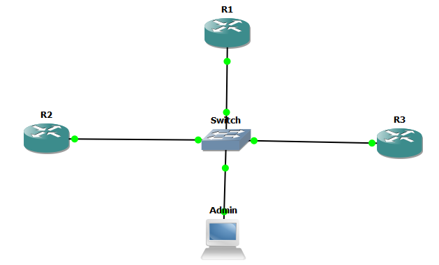
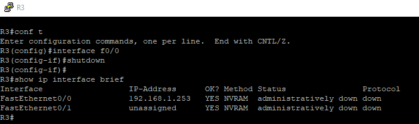
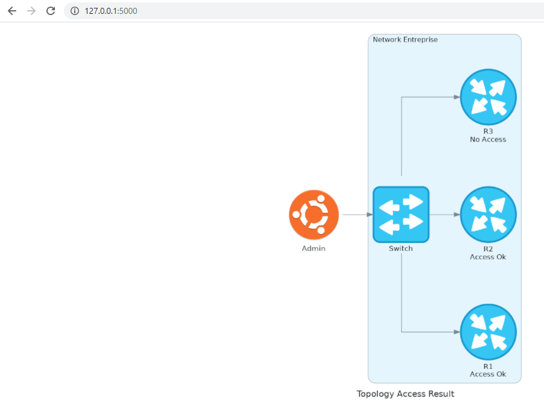

[](https://developer.cisco.com/codeexchange/github/repo/cherifimehdi/Graphical_Check_Access)

# Auto web-based graphical check access to network devices

This project aims to generates automatically the topology of the entreprise showing if there is an access to the network devices. It leverages the modules [Flask](https://flask.palletsprojects.com/en/2.0.x/) and [Diagrams](https://diagrams.mingrammer.com/) with [Genie/pyATS](https://pubhub.devnetcloud.com/media/genie-docs/docs/cookbooks/index.html) framework with its ___connect()___ method in order to check the access by simply handling ___ConnectionError___ exception as in [Check_Access](https://developer.cisco.com/codeexchange/github/repo/cherifimehdi/Check_Access) project related with [Validate/Monitor access to network devices with the integration of Genie/pyATS, WebEx Messenger and Syslog server](https://developer.cisco.com/network-automation/detail/31f2a492-d5b7-11eb-95a0-c6918c6fb71b/) use case.

In summary, this project : 
- Periodically attempt access to network devices

- Display the result as a topology with the result displayed below each device name : ___Access Ok___ or ___No Access___

# Important remarks

1. Please run once the script graphical_check_access.py and please keep refresh priodically the web page of the project (http://127.0.0.1:5000 for this case).
The project generates for each refresh a new topology and then, a new state based on the access to the network devices. You can automate the refreshing process  by using either some extention such as [Tab Reloader](https://github.com/james-fray/tab-reloader/) or some python module such as [pyautogui](https://pyautogui.readthedocs.io/en/latest/) or [selenium](https://selenium-python.readthedocs.io/getting-started.html)  
It is imortant to indicate the part of the script __graphical_check_access.py__ that makes the update in topology for each refresh is shown in the part below with __Check_Access(testbed)__ is the function that ensures the access check to the devices throught their management interfaces.

```python
return render_template('index.html', result = Check_Access(testbed))
```

2. The image __Topology_Result.png__ containing the result rendening in the web page is overwritten for each refreshing of the web page. The topology is the same as that used in this demo as multi access topology. You can generate a topology according to yours but the goal here is to check access then it is
better to simulate any physical topology as logical multi access topology to avoid modification in the script and to simplify the analyse of result.

# Topology and Simulation

Here is the topology used in this project:




[GNS3](https://gns3.com/) was used with Cisco routers and a Linux machine as Admin since the framework __Genie/PyATS__ works only on Linux or Mac OSX. However, you can use the Windows Subsystem for Linux (WSL, as the case used in this project). You can also test this project using your own emulator or the [DevNet Sandbox Cisco Modeling Labs (CML)](https://devnetsandbox.cisco.com/RM/Topology). You just need to modify the parameters concerning the information about the devices used in the __connex.yml__ file (IP addresses, users, IOS type, ...).

 
# Packages installation and Requierements

The best practice is to leverage Python Virtual Environments (env). Please follow these steps to clone the Git repository and create and active the virtual environment:

```
git clone https://github.com/cherifimehdi/Graphical_Check_Access.git
cd Graphical_Check_Access
python3 -m venv venv
source venv/bin/activate
pip3 install -r requirements.txt
```
   
As the packages used are found in requirements.txt file, alternatively, you can install the packages as follows:

```
pip3 install pyats[full]
pip3 install flask
pip3 install diagrams
```
## Note
[Diagrams](https://diagrams.mingrammer.com/) requires  [Graphviz](https://graphviz.gitlab.io/) to render the diagram. You need to install [Graphviz](https://graphviz.gitlab.io/download/) and [Python 3.6](https://www.python.org/downloads/) or higher.

# Before using the Graphical_Check_Access Project

Please consider to:

1. Modify the parameters in ___connex.yml___ file according to your devices configuration and types (IOS, ip, credentials,...)
2. Save the __index.html__ file in the folder __templates__ and the two images __Router.jpg__ and __Switch.png__ in the folder __static__ (in this case the same folder as the topology generated and overwritten each time containing the state of the devices __Topology_Result.png__)

# Graphical_Check_Access project in action

Here we run the __graphical_check_access.py__ script from the __Admin__ host:

```console
(Graphical_Check_Access) [mehdi@Graphical_Check_Access]$ python graphical_check_access.py

 * Serving Flask app 'graphical_check_access' (lazy loading)
 * Environment: production
   WARNING: This is a development server. Do not use it in a production deployment.
   Use a production WSGI server instead.
 * Debug mode: on
 * Running on http://127.0.0.1:5000/ (Press CTRL+C to quit)
 * Restarting with stat
 * Debugger is active!
 * Debugger PIN: 615-503-771
 ```
 Now we provoke the execution of the project by taping the address of the web page http://127.0.0.1:5000. This allows to generate the topology of the entreprise showing the network devices with their access state.
 

 We can also visualize the successful of the request from the console

 ```console
 127.0.0.1 - - [19/Aug/2021 17:25:00] "GET / HTTP/1.1" 200 -
127.0.0.1 - - [19/Aug/2021 17:25:00] "GET /static/Topology_Result.png HTTP/1.1" 200 -  
```
Now we will deactivate the management interface of the router __R3__



We provoke the re-execution of the project just by refreshing the web page. We can also use the auto scheduling by referring to one of the solutions described above. Here the result



and the successful from the console

```console
127.0.0.1 - - [19/Aug/2021 17:26:45] "GET / HTTP/1.1" 200 -
127.0.0.1 - - [19/Aug/2021 17:26:45] "GET /static/Topology_Result.png HTTP/1.1" 200 -
```
Here the console in summary for the two states:


```console
(Graphical_Check_Access) mehdi@Graphical_Check_Access$ python graphical_check_access.py
 * Serving Flask app 'graphical_check_access' (lazy loading)
 * Environment: production
   WARNING: This is a development server. Do not use it in a production deployment.
   Use a production WSGI server instead.
 * Debug mode: on
 * Running on http://127.0.0.1:5000/ (Press CTRL+C to quit)
 * Restarting with stat
 * Debugger is active!
 * Debugger PIN: 615-503-771
127.0.0.1 - - [19/Aug/2021 17:25:00] "GET / HTTP/1.1" 200 -
127.0.0.1 - - [19/Aug/2021 17:25:00] "GET /static/Topology_Result.png HTTP/1.1" 200 -
127.0.0.1 - - [19/Aug/2021 17:26:45] "GET / HTTP/1.1" 200 -
127.0.0.1 - - [19/Aug/2021 17:26:45] "GET /static/Topology_Result.png HTTP/1.1" 200 -
```
We can see for the two cases that we have the state of each device (___Access Ok___ or ___No Access___) below its name.

# About me

PhD in Electronics and an active Cisco CCAI Instructor and Network Engineering Trainer. Part of Cisco DevNet Class 2020. Cisco DevNet Code Exchange and Automation Exchange Contributor.
I am interesting in all about NetDevOps, Networking programmability and automation. I am a Cisco contents fan.
## Contact Me

[LinkedIn](www.linkedin.com/in/cherifi-mehdi)

[GitHub](https://github.com/cherifimehdi)

[Credly](https://www.credly.com/users/mehdi-cherifi/badges)

[Twitter](https://twitter.com/LocketKeepsake)
