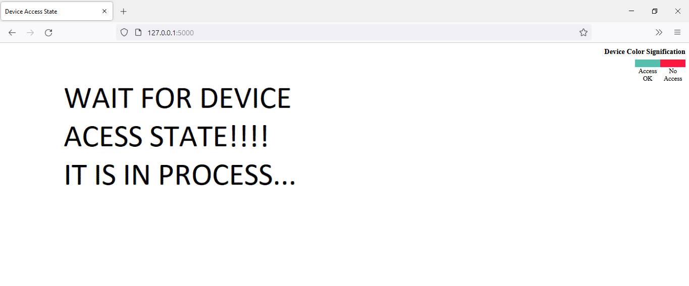
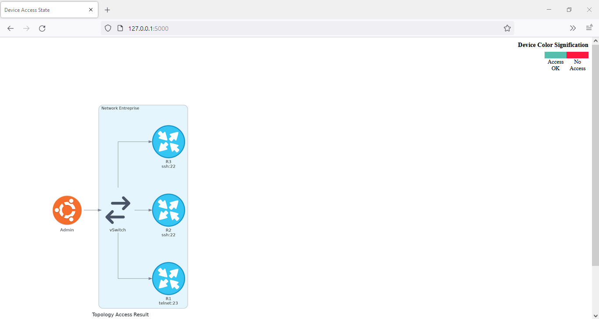
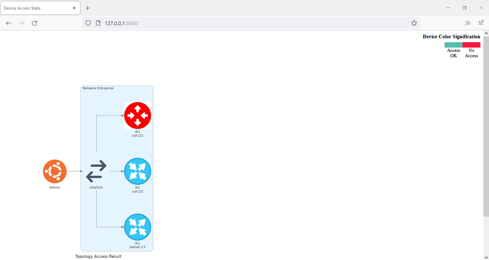
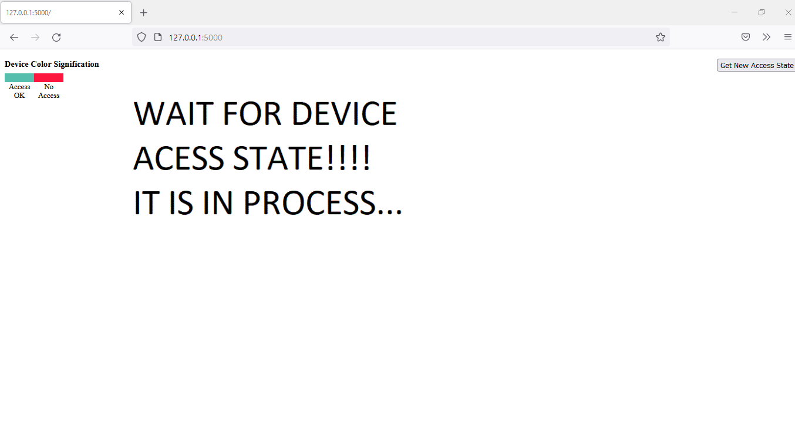
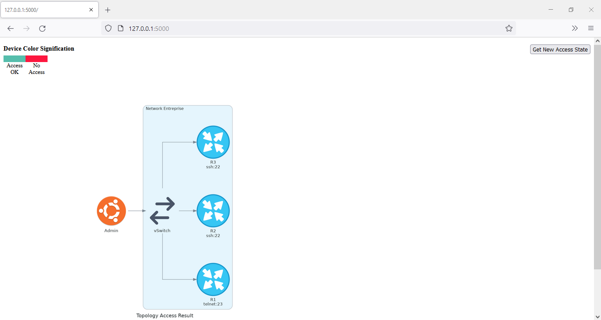
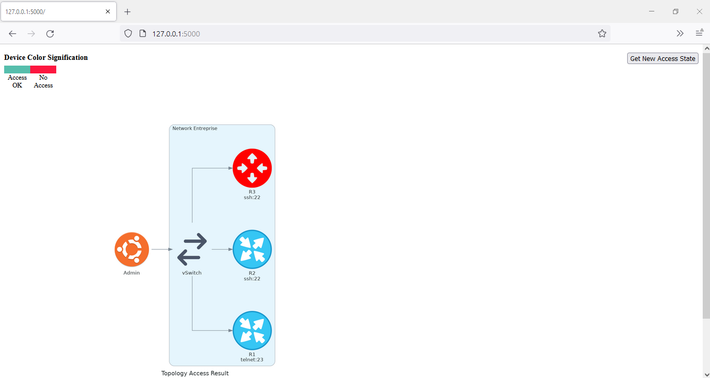

[](https://developer.cisco.com/codeexchange/github/repo/cherifimehdi/Graphical_Check_Access)

# Auto web-based graphical check access to network devices

This project aims to generates automatically the topology of the entreprise showing if there is an access to the network devices. It leverages the modules [Flask](https://flask.palletsprojects.com/en/2.0.x/), [APScheduler](https://apscheduler.readthedocs.io/en/3.x/) and [Diagrams](https://diagrams.mingrammer.com/) with [Genie/pyATS](https://pubhub.devnetcloud.com/media/genie-docs/docs/cookbooks/index.html) framework with its ___connect()___ method in order to check the access by simply handling ___ConnectionError___ exception as in [Check_Access](https://developer.cisco.com/codeexchange/github/repo/cherifimehdi/Check_Access) project related with [Validate/Monitor access to network devices with the integration of Genie/pyATS, WebEx Messenger and Syslog server](https://developer.cisco.com/network-automation/detail/31f2a492-d5b7-11eb-95a0-c6918c6fb71b/) use case.

In summary, this project : 
- The function __Check_Access__ is scheduled in background with __APScheduler__ and excecuted periodically in order to retrieve the actual topology access state of the devices.

- A Flask route that retrieve and display the topology access state with legend indicating the access state according to the color : <span style="color:red">Red device</span> in case ___No Access___ and <span style="color:blue">Blue device</span> in case ___Access Ok___. There is two templates: __Auto Access State__ and __On demand Access State__. In both cases, there is a GIF animation indicating that the topology access state is on process in the case that this latter is not previusly generated or deleted in some reason by the admin.
1. __Auto Access__ : Retrieve periodically the topology access state with auto refreshing the web page. Feel free to change the period time in __index_auto_refresh_state.html__
2. __On-demand Access__ : The admin can retrieve the actual topology access state of the devices using a botton. 

# Topology and Simulation

Here is the topology used in this project:


[GNS3](https://gns3.com/) was used with Cisco routers and a Linux machine as Admin since the framework __Genie/PyATS__ works only on Linux or Mac OSX. However, you can use the Windows Subsystem for Linux (WSL, as the case used in this project). You can also test this project using your own emulator or the [DevNet Sandbox Cisco Modeling Labs (CML)](https://devnetsandbox.cisco.com/RM/Topology). You just need to modify the parameters concerning the information about the devices used in the __connex.yml__ file (IP addresses, users, IOS type, ...).

 
# Packages installation and Requierements

The best practice is to leverage Python Virtual Environments (env). Please follow these steps to clone the Git repository and create and active the virtual environment:

```
git clone https://github.com/cherifimehdi/Graphical_Check_Access.git
cd Graphical_Check_Access
python3 -m venv venv
source venv/bin/activate
pip3 install -r requirements.txt
```
   
As the packages used are found in requirements.txt file, alternatively, you can install the packages as follows:

```
pip3 install pyats[full]
pip3 install flask
pip3 install diagrams
pip install apscheduler
```
## Note
[Diagrams](https://diagrams.mingrammer.com/) requires  [Graphviz](https://graphviz.gitlab.io/) to render the diagram. You need to install [Graphviz](https://graphviz.gitlab.io/download/) and [Python 3.6](https://www.python.org/downloads/) or higher.

# Before using the Graphical_Check_Access Project

Please consider to:

1. Modify the parameters in ___connex.yml___ file according to your devices configuration and types (IOS, ip, credentials,...)
2. Save the __index_auto_refresh_state.html__ and __index_on-demand_state.html__ files in the folder __templates__ and the images __router.jpg__, __switch.jpg__, __router-no-access.jpg__, __switch-no-access.jpg__, __vSwitch.png__ and __Access_Problem.gif__ in the folder __static__ (in this case the same folder as the topology generated and overwritten each time containing the state of the devices __Topology_Result.png__)

# Graphical_Check_Access project in action

Here we run the __graphical_check_access.py__ script from the __Admin__ host:

```console
(Graphical_Check_Access) [mehdi@Graphical_Check_Access]$ python graphical_check_access.py

 * Serving Flask app 'graphical_check_access' (lazy loading)
 * Environment: production
   WARNING: This is a development server. Do not use it in a production deployment.
   Use a production WSGI server instead.
 * Debug mode: on
 * Running on http://127.0.0.1:5000/ (Press CTRL+C to quit)
 * Restarting with stat
 * Debugger is active!
 * Debugger PIN: 615-503-771
 ```
### Case 1. ___Auto Access___ 
 We use __index_auto_refresh_state.html__ template to automatically show the access state of the devices periodically.
 Before building the access state : 
 In the case there is an access to the devices: 

 Now we deactivate the access for the router __R3__: 

 In the case there is no access to the devices: 
 
 Here a demonstration of the process: 

 ### Case 2. ___On-demand_ Access__
 We use __index_on-demand_state.html__ template to give the admin the possibility to retirive the access state of the devices using a botton.
 Before building the access state : 

 In the case there is an access to the devices: 

 Now we deactivate the access for the router __R3__: 
 
 In the case there is no access to the devices: 

 Here a demonstration of the process: 
 


# About me

PhD in Electronics and an active Cisco CCAI Instructor and Network Engineering Trainer. Part of Cisco DevNet Class 2020. Cisco DevNet Code Exchange and Automation Exchange Contributor.
I am interesting in all about NetDevOps, Networking programmability and automation. I am a Cisco contents fan.
## Contact Me

[LinkedIn](www.linkedin.com/in/cherifi-mehdi)

[GitHub](https://github.com/cherifimehdi)

[Credly](https://www.credly.com/users/mehdi-cherifi/badges)

[Twitter](https://twitter.com/LocketKeepsake)
